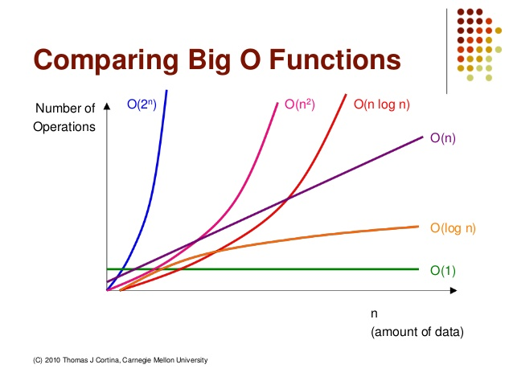

# Learning DataStructure from C language

## Category

- what is DS?
- Linear Search
- Binary Search
- Big-Oh Notation(TODO)

## 1. what is DS?

### Definition

- 자료구조란 >>자료 구조는 데이터 값의 모임, 또 데이터 간의 관계, 그리고 데이터에 적용할 수 있는 함수나 명령를 의미
    - 출처 : [위키백과](https://ko.wikipedia.org/wiki/%EC%9E%90%EB%A3%8C_%EA%B5%AC%EC%A1%B0)

- Time Complexity(시간복잡도)

    - 속도에 해당하는 알고리즘의 수행시간 분석결과를 가리켜 '시간 복잡도'라고 한다.

- Space Complexity(공간복잡도)

    - 메모리 사용량에 대한 분석결과를 가리켜 '공간 복잡도'라 한다.

### Explanation

- 연산 횟수의 함수 -> T(n)
- 알고리즘의 수행속도를 평가할 때는 연산의 횟수를 통해서 빠르기를 판단한다.


## 2. Linear Search

### Definition

- 순차적으로 자료구조를 탐색하는 것
- 리스트에서 찾고자 하는 값을 맨 앞에서부터 끝까지 차례대로 찾아 나가는 것
 
### Explanation

- 최상의 경우/ 평균적인 경우/ 최악의 경우
- T(n)=1  /   T(n)=3/4n   /   T(n)=n
- [최악의 경우]를 시간 복잡도의 기준으로 삼음
- T(n)=n


## 3. Binary Search

### Definition

- 이진 검색 알고리즘은 오름차순으로 정렬된 리스트에서 특정한 값의 위치를 찾는 알고리즘

### Explanation

- 처음 중간의 값을 임의의 값으로 선택하여, 그 값과 찾고자 하는 값의 크고 작음을 비교하는 방식을 채택
- T(n)= Log2n

## 4. Big-Oh Notation

### Definition

- 정의
```
계산 복잡도 이론에서 사용되는 점근 표기법. 컴퓨터 과학에서는 주로 입력 데이터의 크기와 알고리즘의 소요 시간 또는 메모리의 상관관계를 나타내지만, 엄밀히는 임의의 함수에 대하여 "함수의 입력값(정의역의 원소)이 커짐에 따라 그 출력값(그 원소의 상)이 얼마나 빠르게 커지는가"를 표현한다.
```

### Explanation

- 대표적인 빅오 표기
    1. O(1)
    2. O(logn)
    3. O(n)
    4. O(nlogn)
    4. O(n^2)
    5. O(n^3)
    6. O(2^n)


### Additional Resources



### Reference

## Definition
### Explanation
### Additional Resources
### Reference

